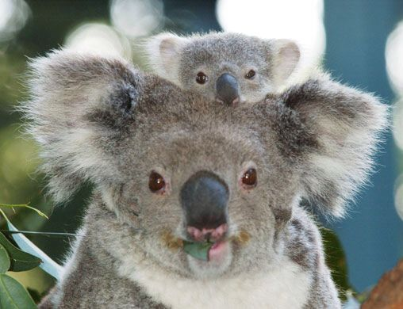

This is my first post on my new blog! How exciting!

I'm sure I'll write a lot more interesting things in the future.

"hello-world" just reminds me koalas, I don't know why, but it does. 

Oh, and here's a great quote from this national geographic on
[Koala](https://www.nationalgeographic.com/animals/mammals/k/koala/).

>Though often called the koala “bear,” this cuddly animal is not a bear at all; it is a marsupial, or pouched mammal. After giving birth, a female koala carries her baby in her pouch for about six months. When the infant emerges, it rides on its mother's back or clings to her belly, accompanying her everywhere until it is about a year old.

